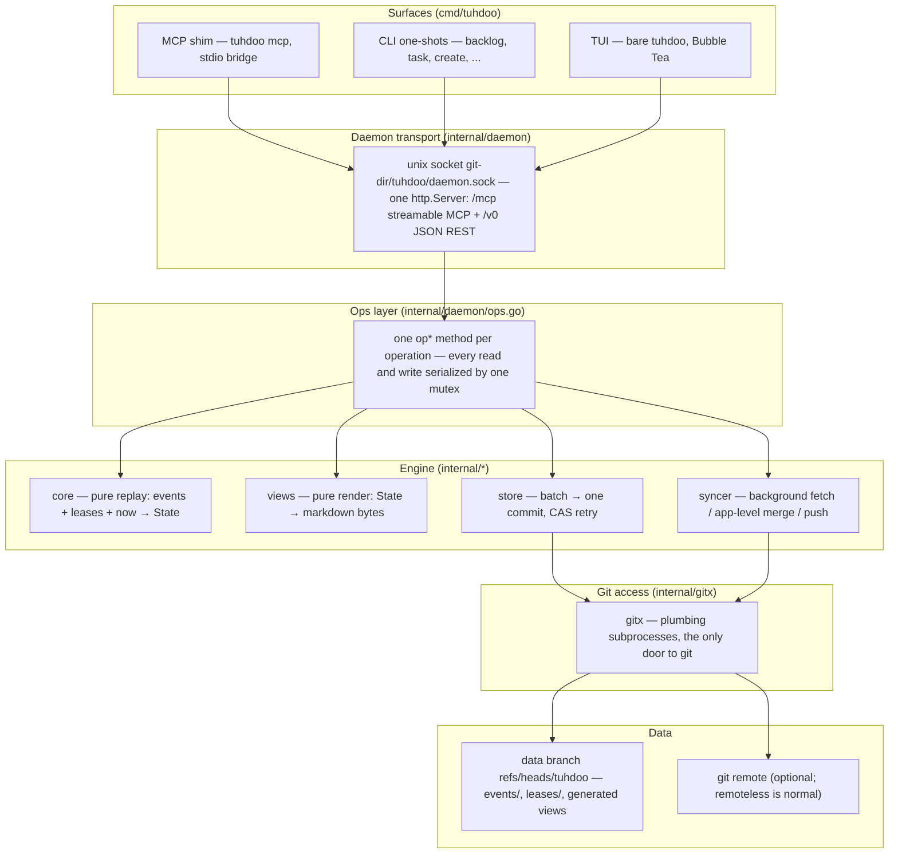

# tuhdoo — architecture map

**Snapshot of 2026-08-12. Regenerate, don't patch:** this map was written from a fresh read of the tree on that date. When it drifts from the code, produce a new one the same way rather than editing this one line by line. Depth and rationale live in the design docs (`design/001-core-design.md`, `design/002-technology.md`); this file is orientation.

## System diagram

Five layers, writes flowing top to bottom. `core` and `views` are pure — they receive data and return data, and nothing below them ever calls back up.

Relationships the layering can't draw:

- The daemon caches the last replayed `core.State` and rebuilds it on demand (`refreshLocked`); when the syncer lands a merge it calls back via an `OnMerged` callback → `Daemon.Refresh`. That callback is the one upward arrow in the system.
- `confirm_claim` (and the gate inside `finish_run(done)`) is the one place a request synchronously touches the network: ops calls the syncer's `GateHead`/`GatePush`, which race a `claim.confirmed` event through the remote's ref CAS (`internal/syncer/gate.go`).
- The shim is itself an MCP client of the daemon's `/mcp` endpoint: it mirrors the daemon's tools verbatim onto stdio. No surface touches git or the data branch directly — everything funnels through the daemon.
- The TUI and CLI speak only `/v0` REST; agents speak only `/mcp`. Both land on the same `op*` methods in `ops.go`, so the surfaces cannot disagree about semantics.

## One call, end to end: `claim_next`

What actually happens, at 2026-08-12 HEAD, when an agent's harness calls the `claim_next` tool:

1. **Shim** (`cmd/tuhdoo/mcp_cmd.go`): `tuhdoo mcp` derived the human principal from `git config user.email` at startup and auto-spawned the daemon if none was live (`ensureDaemon`). On the session's first request it opened a streamable-MCP client session to `http://tuhdoo/mcp` over the unix socket, sending `X-Tuhdoo-Actor` / `X-Tuhdoo-Agent-Name` headers; the daemon minted the session principal (`human/client-n`) once. The `claim_next` handler is a pure forwarder.
2. **MCP handler** (`internal/daemon/mcp.go`): the tool closure decodes `{labels}` and calls `d.opClaimNext(principal, labels)`.
3. **Serialization** (`internal/daemon/ops.go`): `opClaimNext` takes `d.mu` — the single write mutex — and holds it for the whole query-and-claim. Degraded (fail-safe read-only) mode rejects the write here.
4. **Replay** (`daemon.refreshLocked` → `store.LoadReplayInput` → `core.Replay`): one `rev-parse` + one `ls-tree` on the data branch, events and leases decoded through OID-keyed caches, overlay events not yet committed appended, then a pure fold into `core.State`. Claim winner rules and lease expiry are decided inside replay, against event ULID timestamps and the leases map — never a live clock read.
5. **Selection** (`core.ReadyTasks`): open tasks with no active claim, no unmet dependency, no open blocking escalation; priority descending, ULID order within a priority. First candidate carrying every requested label wins; no match returns `claimed: false` as a normal result, not an error.
6. **Event append** (`claimTargetLocked` → `newEventLocked` → `stageLocked`): a `claim.made` (v1) event is minted — payload empty; task, actor, machine ride the envelope — staged into the in-memory overlay, and flushed **eagerly** through the batcher (claims race across machines, so they never wait out the 2s debounce).
7. **Commit** (`store.AppendBatch` → `gitx`): blob hashed, then a CAS loop — read ref, read tree, merge paths, `mktree`/`commit-tree`/`update-ref` with compare-and-swap, retried on CAS loss. One batch, one commit, worktree untouched.
8. **Lease** (`store.WriteLease`): `leases/<claimID>.json` with a 15-minute expiry lands as a second, files-only commit. If it never lands, replay treats the claim as lapsed — self-healing, not corruption.
9. **Response**: a second `refreshLocked` replays the world including the new claim; the task is hydrated (description, notes, runs, escalations, edit history, lease expiry) and returned with the confirm-before-merge warning. The session tracks the claim and a per-session goroutine renews the lease every 5 minutes for as long as the session lives.
10. **Afterwards, asynchronously**: the syncer's background loop (60s cadence, or when poked) fetches, merges app-level, and pushes the new commits. The claim path itself does not poke the syncer, and it does not regenerate views — `views.Render` runs only on writes that go through `commitLocked` (create/update/finish/escalate/note), so a claim leaves the rendered views stale until the next such write or sync-triggered refresh.

## Packages

### internal/event — governed by T3

The on-disk event format as pure functions: the versioned envelope, canonical JSON bytes, ULID identity and paths, and the event-type catalog with unknown-field preservation. A leaf package (stdlib + ulid only).

- Files: `event.go` (envelope, `New`/`Encode`/`Decode`), `catalog.go` (type constants, `Versions` map, nine payload structs), `canonical.go` (`Canonicalize`, the single authority on canonical bytes).
- Key types: `Event`, the payload structs (`TaskCreated`, `ClaimMade`, `RunFinished`, …), `Versions`.
- Invariants owned: byte determinism (same event → identical bytes); decode→encode round-trips are byte-identical even for events carrying unknown fields from newer peers; decode is strict (missing required fields error, never skip); versioning is additive-first; `Path`/`IDTime` are pure functions of the ULID.

### internal/core — governed by T1 (with D5/D6 semantics)

The deterministic heart: folds events + leases + a caller-supplied `now` into a `State` projection. Fully pure — no clock, no I/O, no goroutines; consumers are daemon, syncer, views, and the collision harness.

- Files: `replay.go` (the fold, one case per event type, lease-expiry synthesis), `state.go` (projection types and read predicates: `Ready`, `ReadyTasks`, `Blockage`, `Situation`), `upcast.go` (T3 in-memory version ladder; stored bytes never rewritten).
- Key types: `Input`, `Replayer`, `State`, the D5 entity records, `ClaimStatus`, the `ErrCannotReplay`/`ErrMalformedEvent` sentinels.
- Invariants owned: input-order irrelevance (dedupe + ULID sort; tests brute-force permutations); the D6 winner rules (earliest claim holds, lease lapse judged by the newcomer's ULID timestamp, confirmation beats unconfirmed); synthesized `interrupted`/`superseded` runs; fail-stop on anything it cannot understand — no partial state, ever.

### internal/store — governed by T2/T3 storage posture, D9 leases, T8 cadence

Persists events, views, and leases as commits on the never-checked-out data branch, entirely through plumbing objects.

- Files: `store.go` (`Store`, `Init`, `AppendBatch` CAS loop, `LoadReplayInput`, decode caches), `lease.go` (lease format, release tombstones), `batcher.go` (2s debounce coalescing bursts into one commit; views ride along via `AddFiles`).
- Key types: `Store`, `Batch`, `Batcher`.
- Invariants owned: one batch = one commit, ref advanced by CAS with bounded retry; event blobs immutable and never removed; leases never deleted — release writes a tombstone, because a missing lease would replay as "always lapsed" and re-adjudicate settled contests; the working tree stays empty (tests assert nothing but `.git`).

### internal/gitx — governed by T2

The single door to git: an 11-method `Git` interface over the real `git` binary, plumbing commands only, no checkout, no force option anywhere. A leaf package.

- Files: `gitx.go` (interface, `TreeEntry`/`Identity`, five sentinel errors), `cli.go` (`CLI` implementation: subprocess plumbing, version floor ≥ 2.40, error classification into sentinels).
- Key types: `Git`, `CLI`, sentinels `ErrRefCASFailed`/`ErrRefNotFound`/`ErrNonFastForward`/`ErrNoRemote`/`ErrRemoteRefMissing`.
- Invariants owned: CAS-only ref writes; fail loud, never best-effort (path validation, non-blob rejection, no-gpg-sign so a daemon can't hang on a prompt); remoteless classified as normal (`ErrNoRemote`), never a crash; locale pinned so error text classifies reliably.

### internal/syncer — governed by D2/D10 topology, T2, D6 gate, T8 cadence

The network half of convergence: a background loop (60s default, pokeable) that fetches into a private tracking ref, reconciles divergence with a deterministic app-level merge — git's merge machinery is never invoked — and pushes, unforced. Also the referee's legwork for the synchronous confirmation gate.

- Files: `syncer.go` (`Run`/`Poke`/`Stop`/`Status`, `Cycle`), `merge.go` (per-area merge rules: events same-path-different-content is fatal, leases resolved tombstone-beats-plain then expiry then OID tiebreak, views highest-format-wins), `gate.go` (`GateHead`/`GatePush` — landing `claim.confirmed` through the remote's ref CAS), `adopt.go` (clone-join at startup).
- Key types: `Syncer`, `Options`, `Status` (mode local-only/syncing/error, collision and merge counters).
- Invariants owned: merges are pure functions of the two trees (frozen-clock replay), so both peers produce byte-identical merge commits; never force-push; CAS losses and missing remotes are states, not errors; nothing lands locally before the remote accepts a gate push.

### internal/daemon — governed by T4 topology, T5 surface

The per-repo daemon: single-instance flock, one unix socket, one write mutex, and one implementation of every operation projected onto two thin surfaces (JSON REST for humans, streamable MCP for agents).

- Files: `daemon.go` (lifecycle, lock/socket/`daemon.json` discovery, cached state, staging/commit, fail-safe degrade), `ops.go` (every `op*` method, the D6 confirmation gate, hydration), `mcp.go` (per-session MCP servers, principal minting, session claim tracking, lease auto-renewal), `api.go` (`/v0` REST mux and wire shapes).
- Key types: `Daemon`, `Options`; nearly everything else deliberately unexported.
- Invariants owned: every read and write behind one mutex ("boring wins over a RWMutex"); the lock is never held across network I/O — `opFinishRun` drops it for the gate and re-validates after; leases renew only while the owning session lives; a replay failure degrades to read-only 503s rather than best-effort writes; exactly twelve MCP tools.

### internal/views — governed by T6

Pure renderer from `core.State` to the generated markdown on the branch root: `README.md`, `backlog.md`, `escalations.md`, `tasks/<id>.md`, plus the `.views-meta.json` format stamp (currently format 9).

- Files: `views.go` is the whole package; the golden files under `testdata/golden/` are the real rendering contract.
- Key types/functions: `Render`, `FormatVersion`, `CanWrite`/`Format` (highest-version-wins guard), `HumanStatus` (the one stored-status → displayed-word mapping, shared by CLI and TUI).
- Invariants owned: exact path set; no clock reads (grep-enforced by a test) and no map-iteration ordering — byte-identical output for the same state; ready ordering matches `core.ReadyTasks` so the rendered backlog agrees with what `claim_next` serves; a higher stored format version means a newer peer owns the views and this generator writes events only.

### cmd/tuhdoo — governed by T7 surfaces, T4 lifecycle

The entry binary: hand-rolled subcommand dispatch (no CLI framework), a Bubble Tea TUI on bare invocation, scriptable one-shots, the stdio MCP shim, and daemon spawn/discovery. Every path is an HTTP client of the daemon.

- Files by concern: `main.go` (dispatch), `commands.go`/`write_cmds.go`/`render.go`/`snapshot.go` (one-shots), `mcp_cmd.go` (shim: `runMCP`, `bridgeMCP`, tool mirroring, fail-loud session watchdog), `top.go`/`textinput.go`/`selection.go` (TUI: `topModel` with Elm-style `Init`/`Update`/`View`, 2s poll, writes as commands), `client.go`/`daemon_cmd.go`/`repo.go` (spawn, unix transport, repo and principal derivation).
- Invariants owned: the shim exits loudly when its daemon session dies (leases stop renewing — looking connected would be a lie); TUI state changes only via poll/action messages, never directly on keypress; principal derivation fails loudly rather than inventing a name.

### Root package + harness/collision

- `embed.go` at the repo root exists for one line: `//go:embed docs/agent-protocol.md` (embed paths can't climb `..`), served by `tuhdoo protocol` and pinned to the file by a test.
- `harness/collision` is a standalone `go run` program, not part of the binary: it builds fresh, creates a bare origin plus two clones, opens one MCP session per clone, and deliberately storms the claim path behind barriers to exercise the D3 set-union merge and the D6 confirmation gate that solo dogfooding never reaches, machine-checking convergence, the single refereed winner, and the loser records.
